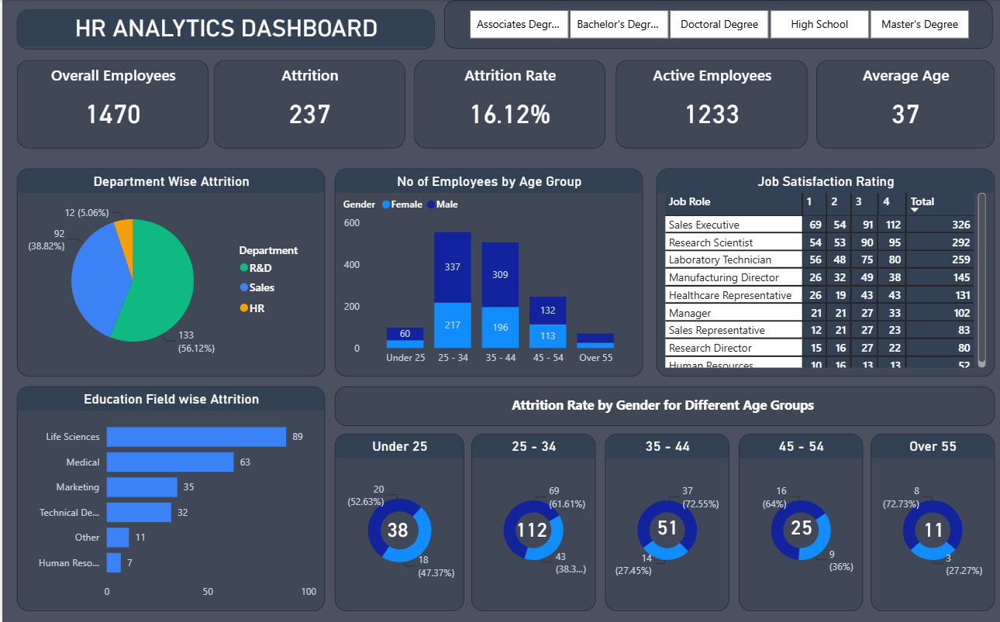

# 📊 HR Analytics – Employee Attrition Analysis

## 📌 Project Overview

This project analyzes employee data to understand employee attrition and identify factors associated with employees leaving an organization.

The project follows an end-to-end Data Analyst workflow using:

- SQL Server
- Python
- Pandas
- NumPy
- Matplotlib
- Power BI

The analysis focuses on employee attrition, departments, job roles, salary, overtime, job satisfaction, age, experience, and other employee-related factors.

---

## 🎯 Business Objective

The main objective of this project is to help HR teams understand employee attrition and identify areas that may require attention.

The analysis answers questions such as:

- What is the overall employee attrition rate?
- Which departments have the highest attrition?
- Which job roles have the highest employee turnover?
- Does overtime relate to attrition?
- How does monthly income differ between employees who stayed and those who left?
- Does age relate to employee attrition?
- How does job satisfaction relate to attrition?
- How does employee experience relate to attrition?

---

## 🗂️ Dataset

The dataset contains **1,470 employees and 41 columns**.

Key fields include:

- Employee Number
- Attrition
- Department
- Gender
- Age
- Job Role
- Marital Status
- Education
- Education Field
- Business Travel
- Over Time
- Monthly Income
- Job Satisfaction
- Environment Satisfaction
- Performance Rating
- Total Working Years
- Years At Company
- Years In Current Role
- Years Since Last Promotion
- Years With Curr Manager
- Work Life Balance
- Training Times Last Year

---

## 🛠️ Tools & Technologies

| Tool | Purpose |
|---|---|
| Excel / CSV | Dataset |
| SQL Server | Data analysis |
| Python | Exploratory data analysis |
| Pandas | Data manipulation |
| NumPy | Numerical analysis |
| Matplotlib | Data visualization |
| Power BI | Interactive dashboard |

---

## 🔄 Project Workflow

```text
Raw Dataset
     ↓
Data Understanding
     ↓
Data Quality Checks
     ↓
SQL Analysis
     ↓
Python EDA
     ↓
Power BI Dashboard
     ↓
Business Insights
     ↓
Recommendations
```

---

# 🗄️ SQL Analysis

SQL Server was used to perform business-oriented HR analysis.

### Key Analysis

- Total employees
- Total attrition
- Attrition rate
- Active employees
- Department-wise employee distribution
- Department-wise attrition
- Department-wise attrition rate
- Job role-wise attrition rate
- Gender-wise attrition rate
- Overtime vs attrition
- Average age by department
- Average monthly income by department
- Monthly income by attrition
- Average income by job role
- Job satisfaction vs attrition
- Work-life balance vs attrition
- Experience vs attrition
- Performance rating vs attrition
- Top 10 highest-paid employees
- Job role ranking by attrition rate
- Employees earning below average income
- Department with highest attrition rate
- Overall HR summary

Advanced SQL concepts used:

- CASE WHEN
- Aggregate functions
- GROUP BY
- CTE
- Subqueries
- Window functions
- RANK()

---

# 🐍 Python Analysis

Python was used for exploratory data analysis and visualization.

### Analysis Includes

- Loading the dataset
- Understanding the dataset
- Data quality checks
- Data types and structure
- Statistical summary
- Employee demographics
- Department analysis
- Job role analysis
- Attrition analysis
- Salary analysis
- Age analysis
- Job satisfaction analysis
- Work-life balance analysis
- Experience analysis
- Performance analysis
- Data visualization

### Libraries Used

```python
import pandas as pd
import numpy as np
import matplotlib.pyplot as plt
```

---

# 📊 Power BI Dashboard

The Power BI dashboard provides an interactive overview of employee attrition.

### Dashboard KPIs

| KPI | Value |
|---|---:|
| Overall Employees | 1,470 |
| Attrition | 237 |
| Attrition Rate | 16.12% |
| Active Employees | 1,233 |
| Average Age | 37 |

### Dashboard Visuals

- Department-wise Attrition
- Number of Employees by Age Group
- Gender Distribution by Age Group
- Job Satisfaction Rating by Job Role
- Education Field-wise Attrition
- Attrition Rate by Gender for Different Age Groups
- Education filters

---

## 🖼️ Dashboard Preview

## 📊 Power BI Dashboard



---

# 💡 Business Insights

### 1. Overall Attrition

The organization has **1,470 employees**, with **237 employees leaving**, resulting in an overall attrition rate of **16.12%**.

### 2. Department Attrition

Sales has the highest attrition count among the departments shown in the dashboard.

### 3. Job Role Attrition

Sales-related roles show important attrition patterns and should be investigated further for retention opportunities.

### 4. Overtime

Overtime is an important factor to investigate because employees working overtime show a higher observed attrition rate in the analysis.

### 5. Monthly Income

Employees who left show a different monthly-income distribution compared with employees who stayed.

### 6. Age

Employees who left tend to be younger than employees who remained.

### 7. Job Satisfaction

Job satisfaction levels show different attrition patterns, making employee satisfaction an important area for HR analysis.

### 8. Experience and Tenure

Employees who left generally show lower experience and shorter company-tenure measures compared with employees who stayed.

---

# 💼 Business Recommendations

### 1. Focus on High-Attrition Roles

Investigate why employees in high-attrition job roles are leaving.

Possible areas:

- Workload
- Compensation
- Career growth
- Management
- Employee engagement

### 2. Review Overtime and Workload

HR can review:

- Overtime frequency
- Workload distribution
- Working hours
- Staffing requirements
- Employee well-being

### 3. Improve Employee Satisfaction

Use employee feedback surveys to identify the reasons behind lower satisfaction.

### 4. Support Younger and Less-Experienced Employees

Consider:

- Mentoring programs
- Career development
- Training opportunities
- Clear promotion paths
- Strong onboarding programs

### 5. Review Compensation

Compare compensation levels for high-attrition roles based on experience, responsibilities, and job level.

---

# 📁 Project Structure

```text
HR-Analytics/
│
├── Dataset/
│   └── HR_Data.csv
│
├── SQL/
│   └── Hr_data_SQL_Queries.sql
│
├── Python/
│   ├── Hr_Data.ipynb
│   └── requirements.txt
│
├── PowerBI/
│   └── HR_Dashboard.pbix
│
├── Images/
│   └── HR_Dashboard.png
│
└── README.md
```

---

# 📌 Skills Demonstrated

### SQL
- Data querying
- Data aggregation
- CASE WHEN
- GROUP BY
- CTEs
- Subqueries
- Window functions
- Ranking
- Business analysis

### Python
- Pandas
- NumPy
- Data inspection
- Data quality checks
- GroupBy
- Aggregation
- Exploratory Data Analysis
- Data visualization

### Power BI
- KPI cards
- Interactive filters
- Dashboard design
- Attrition analysis
- Employee demographics
- Job satisfaction analysis

---

# 📈 Conclusion

This HR Analytics project demonstrates an end-to-end approach to analyzing employee attrition using SQL, Python, and Power BI.

The project identifies patterns across departments, job roles, overtime, income, age, satisfaction, and employee experience.

These findings can help HR teams identify employee groups with higher observed attrition and focus retention efforts on areas that require further investigation.

> **Note:** This analysis identifies patterns and associations in the dataset. It does not prove that a particular factor directly causes employee attrition.
